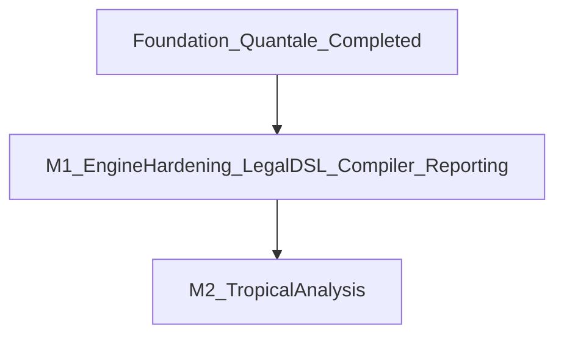

# Plan: Lawyer-Readable DSL + Quantale Core + Tropical Milestone 2

## Canonical Direction

This is the single canonical roadmap for the project. It consolidates the earlier quantale implementation work with the next DSL/compiler/reporting milestone and keeps tropical analysis as a later phase.

The governing design principle is:

> The DSL should look like law, not mathematics.

Quantale and tropical structures remain internal:

- inside the compiler
- inside the engine

They must not appear directly in the primary lawyer-facing surface syntax.

## Consolidated Baseline

The earlier quantale plan is now treated as completed foundation work. The following are considered established infrastructure:

- `Id :: Act r`
- `normalizeAct`
- `composeActs`
- `CapabilityIndex` with `BaseAuthority`
- `capabilitySupremum`
- `Quantale.hs` with `mulNorm`, `joinNorm`, `unitNorm`, `kleeneStar`
- runtime algebra checks in `logic.hs`

This roadmap builds on that foundation rather than replanning it.

## Milestones



## Milestone 1: Engine Hardening + Lawyer-Readable DSL + Reporting

### 1) Engine hardening (small, first)

- Unify fixpoint usage across [Logic.hs](/home/maitreya/HAnSKELLsen/Logic.hs) and [FixedPoint.hs](/home/maitreya/HAnSKELLsen/FixedPoint.hs) by using one canonical fixpoint implementation.
- Align capability order semantics between [Capability.hs](/home/maitreya/HAnSKELLsen/Capability.hs) and `Logic.dominates` with a single ordering source.
- Replace permissive capability string mapping with strict decoding such as `parseCapability`, failing on unknown tokens instead of silently defaulting.
- Explicitly normalize empty parallel composition: `normalizeAct (Par empty) = Id`.

### 2) Law artifacts and storage

- Add `lawlib/statutes/` and `lawlib/contracts/`.
- Add compiler-side `LawMeta` and `LawModule`.
- Keep compiler-owned representations in structured lists before engine integration:
  - `generators :: [IndexedGen]`
  - `rules :: [RuleSpec]`
  - metadata such as `authority`, `enactment`, `name`
- Convert compiler-owned structures to `Norm` only at engine integration time.

### 3) Two-level DSL design

The plan must explicitly distinguish two levels of syntax:

1. Lawyer-facing surface language
2. Compiler/internal IR

Lawyer-facing syntax should resemble structured legal drafting, for example:

```text
obligation Seller must deliver Goods to Buyer
claim Buyer may demand delivery of Goods from Seller

procedure SaleProcedure:
    Seller delivers Goods to Buyer
    Buyer pays Price to Seller
```

Internal IR may use algebraic structure, for example:

```text
Seq [deliverGoods, payPrice]
```

The compiler is responsible for lowering legal drafting syntax into internal quantale-aware structures. Surface authors should not need to read or write symbolic algebra.

### 4) Legal surface language

Add an explicit surface-language specification aimed at lawyers:

- legal sentence grammar
- procedure blocks
- rule clauses
- article and clause layout
- optional headings
- explicit law metadata headers

The surface language should support texts such as:

```text
law SalesLaw
authority legislative
enacted 2025-01-01

article 1
    Seller must deliver Goods to Buyer.

article 2
    Buyer must pay Price to Seller.
```

### 5) Domain entities and symbol tables

The DSL should include explicit sections for domain entities:

```text
parties
    Seller: Alice Corp
    Buyer: Bob

objects
    Goods: movable
    Price: money
```

These sections are the source of compiler symbol tables. The plan must treat this as first-class DSL structure, not an afterthought.

### 6) Vocabulary mapping

Add a vocabulary layer so ordinary legal phrases map into canonical internal acts and entities.

Planned structure:

```text
vocabulary/
    verbs.dsl
    objects.dsl
```

Example intent:

```text
verb deliver(x) -> canonical Deliver
verb pay(x) -> canonical Payment
```

This layer keeps the DSL readable while preserving semantic consistency in the engine.

### 7) Procedure blocks as the primary readable form of sequencing

Procedure blocks should be the primary lawyer-facing syntax for sequential and alternative composition.

Readable sequence:

```text
procedure Sale:
    Seller delivers Goods to Buyer
    Buyer pays Price to Seller
```

Readable alternative:

```text
procedure Payment:
    Buyer pays Price
    or
    Buyer transfers BankCredit
```

Compiler lowering:

- procedure step lists -> `Seq`
- `or` blocks -> join/alternative
- internal parallel constructs remain compiler and engine concepts unless a later surface form is explicitly justified

Quantale operators such as `;`, `|`, `+`, `*`, and `id` remain internal or diagnostic notation, not the primary legal drafting syntax.

### 8) Rule language

Rules must be expressible in legal style with named clauses and explicit if-then structure.

Readable form:

```text
rule DeliveryClaim
    If Buyer owns Goods
    then Buyer may demand delivery of Goods from Seller.
```

Add to the plan:

- named rules
- if-then clause grammar
- deterministic lowering into `RuleSpec`
- rule-level diagnostics tied to legal source spans and clause names

### 9) Controlled natural language constraints

To keep parsing deterministic while preserving readability, the DSL must be a controlled natural language.

Allowed examples:

```text
A must deliver X to B
A may demand X from B
A must not disclose X
```

Disallowed examples:

```text
A should probably deliver X
```

Add an explicit controlled-natural-language specification covering:

- approved clause templates
- approved modal verbs
- approved act phrase shapes
- punctuation and line-break rules
- reserved words and ambiguity restrictions

### 10) AST, parser, and compiler

Implement the compiler pipeline in this order:

- `compiler/AST.hs`
- `compiler/SymbolTable.hs`
- `compiler/Parser.hs`
- `compiler/Compiler.hs`

AST coverage should include:

- laws and metadata
- articles and headings
- parties and objects
- vocabulary entries
- procedures
- rule clauses
- surface modalities
- source spans for diagnostics

Compilation strategy:

- resolve names through symbol tables first
- lower readable legal clauses into canonical act structures
- perform Act-first lowering before generator construction
- keep `+`, `*`, and other algebraic constructs in compiler IR / engine stages, not in primary source syntax
- do not call `mulNorm` or `kleeneStar` directly from parser-stage code

### 11) Legal-style reporting

Add reporting intended for lawyer-readable output rather than raw `Show` instances.

Planned modules:

- [pretty/PrettyNorm.hs](mdc:pretty/PrettyNorm.hs)
- [pretty/PrettyTrace.hs](mdc:pretty/PrettyTrace.hs)
- [pretty/PrettyReport.hs](mdc:pretty/PrettyReport.hs)

Required output style:

- derived obligation / claim / prohibition headings
- readable legal sentences
- explanation text naming the rule or clause that produced the result
- optional article references and source-law references

Example target style:

```text
Derived obligation

Alice Corp must deliver the car to Bob.

Reason:
Claim over a movable object implies a claim for delivery.
```

### 12) Documentation and example law library

The DSL must ship with documentation for non-programmers.

Add:

```text
docs/
    DSL_grammar.md
    legal_examples.md
```

Include:

- a short reference grammar
- explanation of supported clause templates
- examples of obligations, claims, prohibitions, procedures, and rules
- authoring guidance for lawyers and domain experts

Also add example law files:

```text
lawlib/statutes/
    sales.dsl
    lease.dsl

lawlib/contracts/
    car_sale.dsl
```

These examples serve as:

- documentation
- parser tests
- compiler fixtures
- reporting examples

### 13) App integration

- Add [app/Main.hs](mdc:app/Main.hs): load DSL -> parse -> compile -> run inference -> pretty report.
- Keep [logic.hs](/home/maitreya/HAnSKELLsen/logic.hs) as the integration sandbox during migration.

## Milestone 2: Tropical Algebra/Geometry (Vector Weights)

Tropical analysis remains downstream of the readable DSL/compiler/reporting milestone.

### 1) Derivation-path capture

- Introduce derivation graph/path data in an engine-adjacent module:
  - `actions :: [ActRef]`
  - `weight :: CostVector`

### 2) Tropical expression extraction

- Convert alternative derivation paths into tropical polynomials:
  - path composition -> vector addition
  - path alternatives -> tropical min (or configurable order)

### 3) Geometry/export layer

- Export tropical objects to interoperable formats for external tools such as Python, Sage, or polymake workflows.
- Keep the first implementation focused on data export plus derivation graph visualization.

## Key Non-Goals For Milestone 1

- No in-engine tropical solvers initially.
- No replacement of the quantale core.
- No requirement that lawyers author symbolic expressions such as `;`, `|`, `+`, `*`, or `id`.
- No exposure of tropical notation in the primary legal drafting syntax.

## Explicit Additions Required By The Lawyer-Readable DSL Direction

The consolidated plan explicitly includes:

- `LegalSurfaceLanguage`
- `VocabularyMapping`
- `ClauseStructure`
- `ProcedureBlocks`
- `RuleLanguage`
- `DomainEntities`
- `ControlledNaturalLanguage`
- `LegalStyleReporting`
- `DSLDocumentation`
- `ExampleLawLibrary`

## Suggested File Targets

- Existing: [LegalOntology.hs](/home/maitreya/HAnSKELLsen/LegalOntology.hs), [NormativeGenerators.hs](/home/maitreya/HAnSKELLsen/NormativeGenerators.hs), [Logic.hs](/home/maitreya/HAnSKELLsen/Logic.hs), [Quantale.hs](/home/maitreya/HAnSKELLsen/Quantale.hs), [Capability.hs](/home/maitreya/HAnSKELLsen/Capability.hs), [FixedPoint.hs](/home/maitreya/HAnSKELLsen/FixedPoint.hs)
- New: [compiler/AST.hs](mdc:compiler/AST.hs), [compiler/SymbolTable.hs](mdc:compiler/SymbolTable.hs), [compiler/Parser.hs](mdc:compiler/Parser.hs), [compiler/Compiler.hs](mdc:compiler/Compiler.hs)
- New: [pretty/PrettyNorm.hs](mdc:pretty/PrettyNorm.hs), [pretty/PrettyTrace.hs](mdc:pretty/PrettyTrace.hs), [pretty/PrettyReport.hs](mdc:pretty/PrettyReport.hs)
- New: [app/Main.hs](mdc:app/Main.hs)
- New: [docs/DSL_grammar.md](mdc:docs/DSL_grammar.md), [docs/legal_examples.md](mdc:docs/legal_examples.md)
- New: `lawlib/statutes/`, `lawlib/contracts/`, `vocabulary/`

