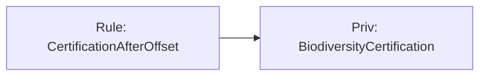

# Audit Infrastructure

This document describes the audit and observability features added to support debugging, programmatic analysis, and visualization of legal reasoning.

## Overview

Three infrastructure features extend the audit pipeline:

1. **Scenario replay** — Audit at every date in a scenario timeline
2. **Structured audit JSON** — Machine-readable audit output for tooling
3. **Derivation graph** — Graph of rule firings and fact dependencies (JSON, DOT, Mermaid)

All preserve the central invariant: the backend remains a monotonic fixpoint system over indexed generators.

---

## 1. Scenario Replay

### Purpose

Instead of auditing a single date, replay runs the audit at **every date** in the scenario timeline. This produces a compliance timeline and helps debug how rules fire as facts accumulate over time.

### Usage

```bash
cabal run hanskellsen-app -- <law-file> --scenario <name> --replay
```

`--replay` requires `--scenario`. The scenario name must match a `scenario` block in the law file.

### Output

For each date in the scenario timeline (in chronological order), the full audit report is printed:

```
=== 2025-01-10 ===
Scenario Audit Report
...

=== 2025-01-12 ===
Scenario Audit Report
...
```

### JSON Replay

Combine with `--format json` for machine-readable replay:

```bash
cabal run hanskellsen-app -- <law-file> --scenario <name> --replay --format json
```

The output is a JSON object with a `replay` array. Each entry has `date` and `audit` (verdict, violation count, rule firing count).

---

## 2. Structured Audit JSON

### Purpose

The default audit report is human-readable text. Structured JSON enables programmatic analysis, visualization tools, or UI layers without touching the reasoning engine.

### Usage

```bash
cabal run hanskellsen-app -- <law-file> --scenario <name> --format json
```

Or without a scenario (audits at enacted date):

```bash
cabal run hanskellsen-app -- <law-file> --format json
```

### Schema (Summary)

The JSON object includes:

| Field | Description |
|-------|-------------|
| `verdict` | `"compliant"` or `"non_compliant"` |
| `auditDate` | ISO date string |
| `scenarioName` | Scenario name or null |
| `violations` | Array of violated norms (capability, time, generator) |
| `fulfilledNorms` | Array of fulfilled norms |
| `enforceableNorms` | Array of enforceable norms |
| `pendingObligations` | Array of pending obligations |
| `activeProhibitions` | Array of active prohibitions |
| `ruleFirings` | Array of rule firings (rule, witnessDay, consequent, insertedNew) |
| `timeline` | Derivation trace by date (seed steps, rule steps) |
| `normativeState` | Active norms in final state |

Each norm is represented as an object with `capability`, `time`, and `generator` (string representation).

---

## 3. Derivation Graph

### Purpose

The engine records rule firing traces, but those traces are linear text. The derivation graph extracts a **structured graph** from an audit result:

- **Nodes**: Generators (facts) and rule applications
- **Edges**: Witness facts → rule, rule → consequent

This supports machine-readable explanation, visualization (e.g. Graphviz, Mermaid), and future tropical reasoning.

### Usage

```bash
# JSON graph
cabal run hanskellsen-app -- <law-file> --scenario <name> --graph json

# Graphviz DOT (for dot, fdp, etc.)
cabal run hanskellsen-app -- <law-file> --scenario <name> --graph dot

# Mermaid flowchart
cabal run hanskellsen-app -- <law-file> --scenario <name> --graph mermaid
```

### Graph Structure

- **Generator nodes**: Facts from scenario seeds and rule witnesses/consequents. Node colors indicate provenance: lightblue (seed), lightgreen (derived), lightyellow (patrimony).
- **Rule nodes**: Each rule firing with condition annotation. Epoch-date triggers show `[institutional fact]` instead of a synthetic date.
- **Edges**: `witness fact → rule` and `rule → consequent`

See [derivation_graph_roadmap.md](derivation_graph_roadmap.md) for the evaluation and improvement roadmap.

### Export Formats

| Format | Use case |
|--------|----------|
| `json` | Programmatic analysis, custom visualization |
| `dot` | Graphviz (`dot -Tpng graph.dot -o graph.png`) |
| `mermaid` | Mermaid diagrams (e.g. in Markdown, GitHub) |

### Example (Mermaid)



---

## CLI Reference

| Option | Description |
|--------|-------------|
| `--scenario <name>` | Select scenario for audit |
| `--audit-at <YYYY-MM-DD>` | Audit at specific date (default: latest scenario date or enacted) |
| `--replay` | Audit at every date in scenario timeline (requires `--scenario`) |
| `--format json` | Output audit as JSON |
| `--graph json` | Output derivation graph as JSON |
| `--graph dot` | Output derivation graph as Graphviz DOT |
| `--graph mermaid` | Output derivation graph as Mermaid |

---

## Implementation Notes

- **Scenario replay**: `runAuditReplay` in [src/Runtime/Audit.hs](src/Runtime/Audit.hs) iterates over `compiledScenarioTimeline` dates and calls `runAudit` for each.
- **JSON export**: [src/Runtime/AuditJson.hs](src/Runtime/AuditJson.hs) provides `auditResultToJson` and `auditReplayToJson` using `aeson`.
- **Derivation graph**: [src/Runtime/DerivationGraph.hs](src/Runtime/DerivationGraph.hs) builds `DerivationGraph` from `AuditResult` and exports to JSON, DOT, and Mermaid.
